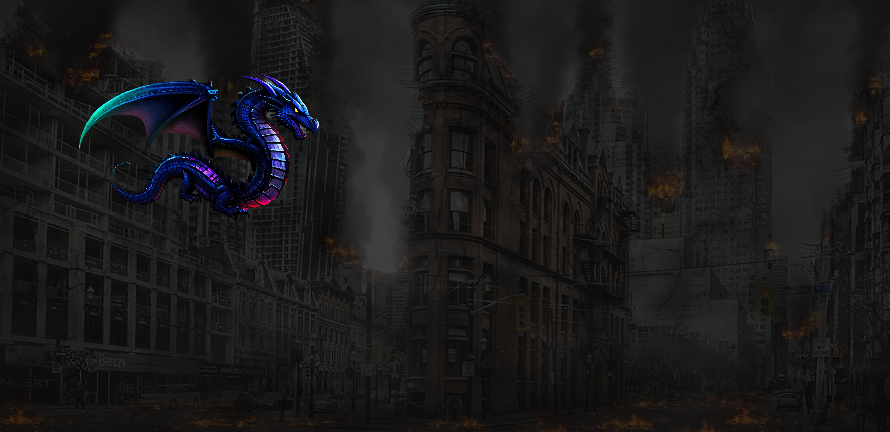

# Dragon Cursor - Cyberpunk Style

An interactive cyberpunk dragon cursor with smooth movement and realistic flickering flame effects. The dragon follows your mouse smoothly without spinning, and clicks trigger a custom fire animation and sound effect.

Features:
- Smooth dragon movement tracking the cursor horizontally and vertically.
- Animated cyberpunk-style flame effect on mouse clicks.
- Sound effect triggered on clicks.
- Background designed as a deserted cityscape, enhancing the immersive vibe.
- Customizable dragon image and audio.

Perfect for adding a futuristic, immersive feel to your personal website or projects!

---

## How to Run

1. Open `index.html` in your browser.
2. Move your mouse to see the dragon follow.
3. Click to see the flame effect and hear the roar.

---

## Technologies

- HTML, CSS, JavaScript
- No external dependencies

---

## Preview

